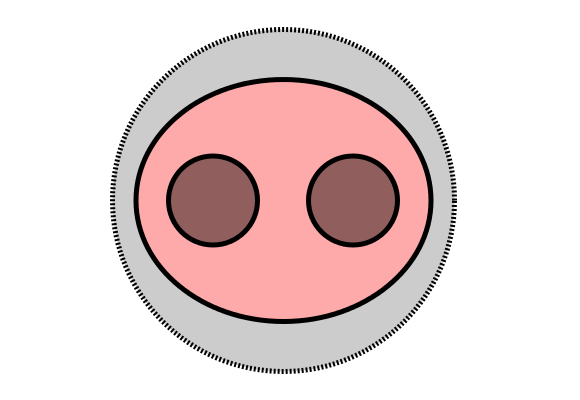

#    Bacoin.io

## What is this?

Have you ever wished for bacon in your crypto? If so, you're in the right place. We have too. Bacoin is a first generation cryptocurrency that has no new tech. It's a pork of Garlicoin with names changed to protect the innocent. We're still writing `sed` commands to replace the names, but it will be available soon. Each bacoin can be divided into 10-8 bacoin bits. Soon you will be able to put bacon on your garlic bread.

## Why does the world need another memecoin?

That's a good question. It doesn't. We do. This is not built for the world. We're not saving the world here, just messing around.

## Where can I buy/spend bacoin?
Probably nowhere. It's worthless. You'll get it form your friends or the community and then send it back to other friends. If you don't have any friends, you'll have to mine it. Hopefull you can make some friends by sending them delicious bacoin.

## Will Bacoin make me rich?
Rich with flavor.

## Links (coming soon)
- Bacoin Core
- Wallet
- Mining

